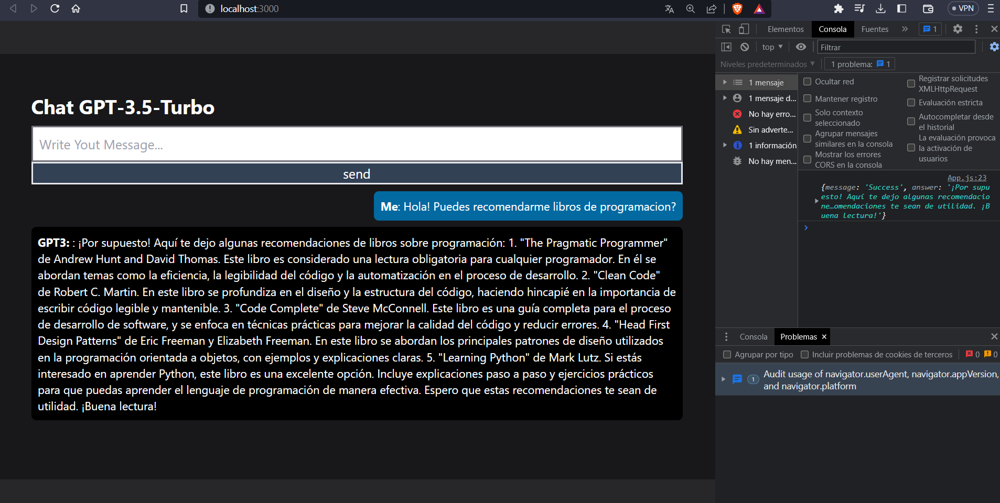

# prueba_tecnica_ad_frontend
El objetivo del proyecto es implementar un chat entre el usuario y modelos de inteligencia artificial. En este caso se usará gpt-3.5-turbo. En este proyecto solamente esta el frontend desarrollado en ReactJS y Javascript.

## Manual Técnico

### Tabla de Contenidos
* [Herramientas a usar e instalación.](#herramientas-e-instalaciones)
* [Comandos importantes.](#comandos-importantes)
* [Desarrollo de proyecto.](#desarrollo-de-proyecto)

### Herramientas e Instalaciones
En este proyecto se esta usando el sistema operativo Windows. La versión de **Node 1v18.12.0** con versión **Npm 8.19.2**.

Instalación de **axios** para poder comunicar con el backend y consumir los endpoints.
```
npm install axios
```
En este caso se uso "fetch" que ya es un modulo nativo de ReactJS para realizar las peticiones.

Instalación de **tailwindcss** para poder darle estilos a nuestros componentes de react. [Enlace de guia de instalacion](https://tailwindcss.com/docs/guides/create-react-app)
```
npm install -D tailwindcss
```

### Comandos importantes
### _React_
Comando para ejecutar nuestro forntend en el puerto 3000.
```
npm run start
```

### _tailwindcss_
Para poder usar tailwind, es necessario tener un archivo de configuracion, el cual se genera con el siguiente comando.
```
npx tailwindcss init
```

Tambien se debe editar el archivo "tailwind.config.js".
```javascript
/** @type {import('tailwindcss').Config} */
module.exports = {
  content: [
    "./src/**/*.{js,jsx,ts,tsx}",
  ],
  theme: {
    extend: {},
  },
  plugins: [],
}
```
Tambien editar el archivo "index.js" del proyecto de React. Se puede dejar solamente esta configuración o agregar a la que ya existe, en este caso solo dejare la de tailwind.
```javascript
@tailwind base;
@tailwind components;
@tailwind utilities;
```

### Desarrollo de Proyecto
Se realizo el proyecto de React.
```
npx create-react-app frontend
```

Se procedio a instalar todas las dependencias que anteriormente fueron descritas. En la seccion de [Herramientas a usar e instalación.](#herramientas-e-instalaciones)

La aplicación es un chat sencillo, por lo que todo se trabajara en el archivo "App.js" sin embargo lo mejor es dividirlo en componentes.

Se realizan las importaciones necesarias. Solo se usara "useState" para el uso de los estados del arreglo de mensajes y el estado del mensaje que el usuario manda al chat.
```javascript
// Archivo frontend>src>App.js
import { useState } from "react";
```

Inicializamos los estados que necesitamos.
```javascript
// Archivo frontend>src>App.js
const [message, setMessage] = useState("")
const [messages, setMessages] = useState([])
```

La logica de la solución es la siguiente.

Tendremos dos "variables" o "States" para poder almacenar los mensajes que se mandan por medio del chat. El usuario mandara un texto por el input y este texto será almacenado por este State.
```javascript
const [message, setMessage] = useState("")
```

Tambien se tendrá un arreglo que almacenara todas las preguntas que se realizan al momento de iniciar la aplciación. Asi ir mostrando nuestro chat mientras la aplciación esta en ejecución.
```javascript
const [messages, setMessages] = useState([])
```

Este arreglo tendra varios JSON almacenados, que seran nuestras preguntas y las respuestas de GPT3. El formato sera el siguiente:
La llave en el JSON sera el receptor o remitente. Mientras que el contenido sera el mensaje.
```javascript
const newMessage2 = {
        body: data['answer'], // Pregunta hecha por usuario o respuesta de GPT3
        from: "GPT3: ", // Remitente o receptor (usuario o GPT3)
      }
```

Realizamos la función asincrona que permitira consumir nuestro endpoit desarrollado en Django. Tomando en cuenta que la peticion POST recibe los parametros "question" y "answer".
```javascript
// Archivo frontend>src>App.js
async function preguntarGPT () {
    // Realizamos la peticion a nuestra API de django
    let response = await fetch("http://127.0.0.1:8000/api/informations/", {
      method: "POST",
      headers: {
        'Content-Type': 'application/json'
      },
      body: JSON.stringify({'question': message, 'answer':""})
    })
    // Guaradamos la respuesta de la peticion en la variable "data"
    let data = await response.json();
    // Condicion para saber si se ejecuto correctamente.
    if (response.status === 200){

      // Realizamos dos JSON que contendran el mensaje que el usuario envía y tambien otro que tendrá la respuesta de GPT3.

      // JSON con pregunta de usuario
      const newMessage = {
        body: message,
        from: "Me",
      }

      // JSON con respuesta de GPT3
      const newMessage2 = {
        body: data['answer'],
        from: "GPT3: ",
      }

      // Le asignamos valor a nuestros estados inicializados anteriormente. 
      // Al array se le asignan los dos mensajes enviados y recibidos.
      setMessages([...messages, newMessage, newMessage2])
      // Para colocar en input un texto en blanco de nuevo.
      setMessage("")

    }else{
      // En dado caso se mostrará un error.
      window.alert("Somthing goes wrong")
    }
}
```

Para el boton se uso un evento que tiene por defecto la funcionalidad de "preventDefault()" usado para que la pagina no se actualice automaticamente al mandar la peticion con el formulario. Tambien se llamo a la funcion realizada anteriormente "preguntarGPT()"
```javascript
<button onClick={(e) => (e.preventDefault(), preguntarGPT())} className='border-2 w-full bg-slate-700'>send</button>
```

En esta parte de la solución solamente se realizo un ".map" con el arreglo que tenemos de los JSON. En este caso se uso un operador ternario para poder identificar quien esta enviando un mensaje. Se definio que la llave para el usuario es "Me" mientas que la llave para GPT es "GPT3". Asi se colcoa un color distinto en el chat.
```javascript
<ul className="h-80 overflow-y-auto">
            {messages.map((message, index) => (
              <li 
                key={index} 
                className={`my-2 p-2 table text-sm rounded-md ${
                message.from === "Me" ? "bg-sky-700 ml-auto" : "bg-black"
                }`}
              >
                <b>{message.from}</b>: {message.body}
              </li>
            ))}
</ul>

```
Por lo demas solamente son estilos de tailwindcss y HTML para realizar el formulario. La captura del fronten es la siguiente.

